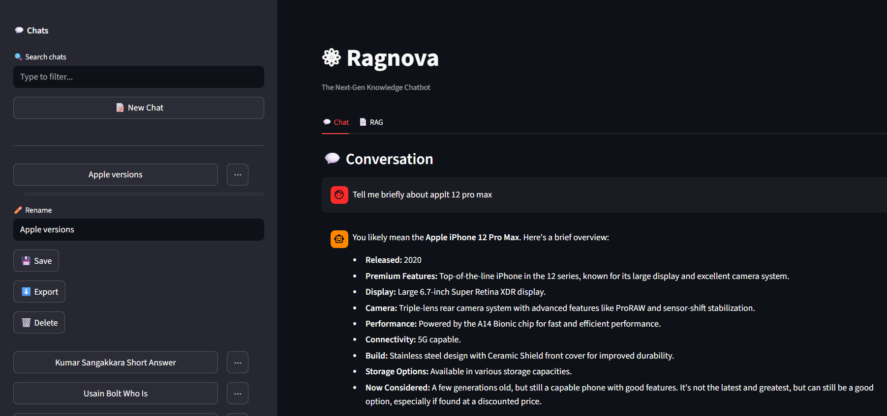
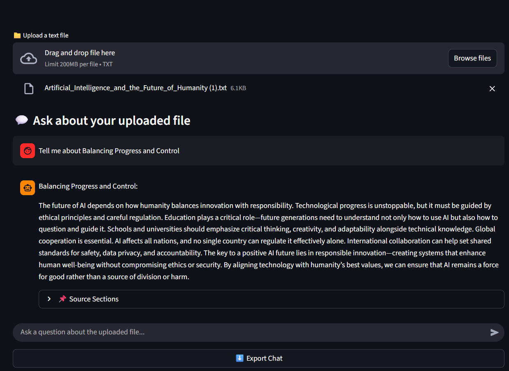
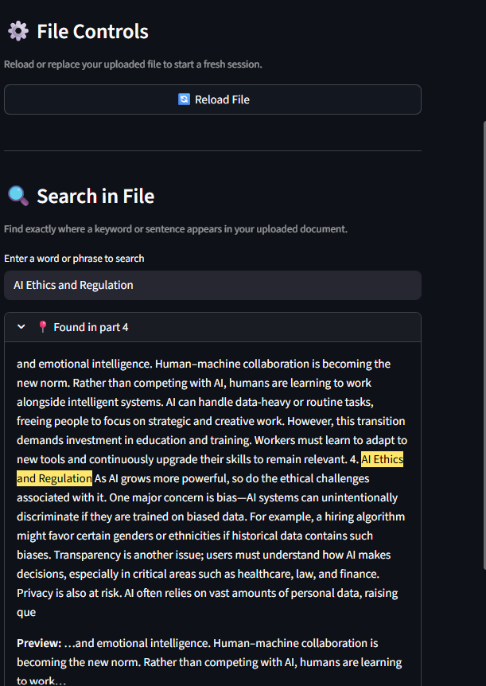

# ⚛ Ragnova (AI Chat Application with RAG)

## 🧠 Overview
This project demonstrates the integration of **Google Gemini 2.0 Flash** with a **Retrieval-Augmented Generation (RAG)** pipeline using **Streamlit** and **MySQL (XAMPP)**.  
It enables real-time chat, document-based Q&A, and keyword search through a clean and interactive UI.

---

## 🧩 Technologies Used

| Component | Description |
|------------|-------------|
| **AI Model** | Google Gemini 2.0 Flash (via `google-generativeai` API) |
| **Embeddings Model** | Sentence Transformers – `all-MiniLM-L6-v2` |
| **Programming Language** | Python 3.10 + |
| **Frameworks / Libraries** | Streamlit, scikit-learn, sentence-transformers, python-dotenv |
| **Database** | MySQL (XAMPP) |

---

## ⚙️ Setup and Installation

### Step 1 – Create Virtual Environment
```bash
python -m venv venv
venv\Scripts\activate        # Windows
# or
source venv/bin/activate     # macOS/Linux
````

Install dependencies:

```bash
pip install -r requirements.txt
```

---

### Step 2 – Add Gemini API Key

Create a file named **.env** in the root project folder and include:

```bash
GEMINI_API_KEY=your_gemini_api_key_here
```

---

### Step 3 – Set Up MySQL Database

1. Start **XAMPP** → launch **MySQL**
2. Open **phpMyAdmin**
3. Create a database named `ai_chat`
4. Run the following SQL script:

```sql
CREATE TABLE conversations (
    id INT AUTO_INCREMENT PRIMARY KEY,
    user_message TEXT,
    ai_response TEXT,
    timestamp TIMESTAMP DEFAULT CURRENT_TIMESTAMP
);
```

---

### Step 4 – Run the Application

```bash
streamlit run ui_app.py
```

Then open [http://localhost:8501](http://localhost:8501) in your browser.

---

## 💬 Application Modes

### 🗨️ Chat Mode

* Open the **Chat** tab
* Type a message → click **Send**
* Gemini 2.0 Flash replies instantly
* Each conversation is saved automatically in **MySQL**

### 📄 RAG Mode

* Open the **RAG** tab
* Upload a `.txt` file → click **Start Conversation**
* Ask questions directly about the uploaded document
* The system retrieves the most relevant chunks using **cosine similarity**
* Gemini generates context-aware answers
* You can:

  * View highlighted relevant text
  * Check similarity scores
  * Search specific keywords
  * Export chat history
  * Reload the uploaded file

---

## 🔍 How RAG Works

1. The uploaded text file is split into overlapping chunks
2. Each chunk is embedded using a **Sentence Transformer**
3. When a user asks a question:

   * The app finds top-matching chunks via **cosine similarity**
   * These chunks are given to **Gemini 2.0 Flash** as context
4. Gemini responds using only the retrieved information
5. The UI shows answers with **highlighted contexts** and relevance scores

---

## 📸 Screenshots

### 💬 Chat Interface



### 📄 RAG Interface – Question 1



### 📄 RAG Interface – Question 2



> 📁 Ensure screenshots are located in a folder named `ss` in the project root:
>
> ```
> project_folder/
> ├── ui_app.py
> ├── rag_engine.py
> ├── chat_logic.py
> ├── db_config.py
> └── ss/
>     ├── chat_interface.png
>     ├── rag_interface_1.png
>     └── rag_interface_2.png
> ```

---

## ✅ Deliverables Checklist

| Item                       | Status |
| -------------------------- | :----: |
| Source Code (GitHub / ZIP) |   ✔️   |
| Short README File          |   ✔️   |
| Working AI Chat + RAG App  |   ✔️   |
| Screenshots Included       |   ✔️   |

---

## 👨‍💻 Developer Information

**Name:** Dimuthu Shalinda
**University:** University of Jaffna – Faculty of Engineering
**Project:** AI Chat Application with RAG
**Date:** October 2025

---

## 🏁 Summary

This project highlights:

* Real-time chat with **Google Gemini 2.0 Flash**
* A full **Retrieval-Augmented Generation** pipeline
* Persistent conversation logging via **MySQL**
* Advanced features:

  * Highlighted context visualization
  * Similarity scoring
  * Keyword search capability
  * Chat export and file reload options

This system combines **LLM reasoning** with **retrieval-based knowledge grounding**, demonstrating how modern AI can deliver accurate, context-aware responses from custom documents.


